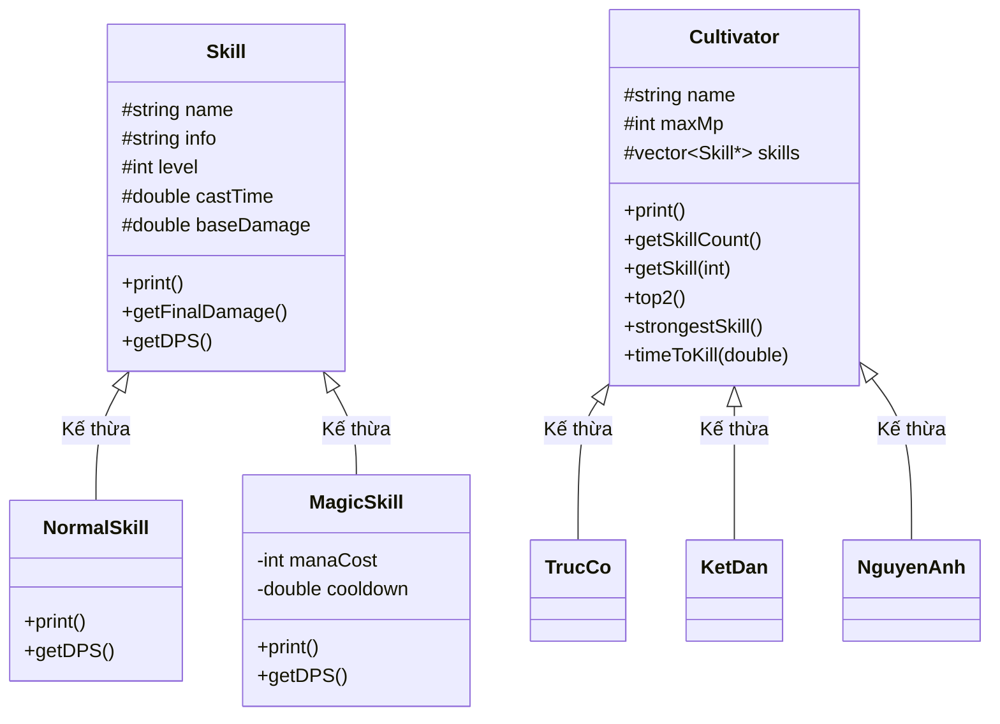

## Đề bài Câu 3 OOP HK2 - 2025_2026

*Lưu ý: Đây là kết quả tham khảo chưa thông qua giảng viên, có thể có sai sót.*

---

### Câu 3 (5.0 điểm) (G2.1, G3.2, G6.1)

Năm 2050, sau hàng loạt biến động địa chất và bức xạ vũ trụ bí ẩn, Trái Đất bước vào thời kỳ khôi phục linh khí. Linh khí - những dòng năng lượng cổ xưa từng biến mất khỏi thế gian - bắt đầu xuất hiện trở lại trong trời đất, làm thay đổi hoàn toàn nền văn minh nhân loại. Các sinh vật đột biến xuất hiện khắp nơi, những di tích cổ đại dần thức tỉnh, còn con người bắt đầu bước lên con đường tu luyện (gọi là tu sĩ) để tranh đoạt tài nguyên và sinh tồn giữa thời đại mới.

Nhưng không phải ai cũng có thể trở thành tu sĩ, mà cần có cơ duyên nhất định. Diệp Phàm là một sinh viên năm 5 học tại UIT. Sau khi học lại môn OOP 49 lần, anh ta đã phát hiện có thể cảm nhận linh khí để bước vào con đường tu tiên. Bên cạnh họ tên, mỗi người tu tiên (gọi là tu sĩ) đều sở hữu những thông tin như:
*   Cảnh giới tu luyện (cấp độ tu luyện - realm)
*   Lượng linh lực (mana point - MP)
*   Danh sách kỹ năng (skill) có thể học được

Tùy theo cảnh giới mà tu sĩ có giá trị linh lực và số lượng kỹ năng học được là khác nhau, và giá trị này sẽ cố định cho từng người. Các cảnh giới tu luyện trên Trái Đất hiện tại gồm Trúc Cơ, Kết Đan, Nguyên Anh.

| Cảnh giới | Mô tả chung | Số lượng kỹ năng | Linh lực tối đa |
| :--- | :--- | :---: | :---: |
| **Trúc Cơ** | Giai đoạn xây dựng nền tảng của việc tu tiên, tu sĩ liên tục cải tạo cơ thể thông qua việc hấp thụ linh khí. Có thể sở hữu tối đa 3 kỹ năng. | `rand(1, 3)` | `rand(1, 100)` |
| **Kết Đan** | Sau khi hấp thụ một lượng lớn linh khí, tu sĩ bắt đầu cô đọng thành hạt nhân bên trong cơ thể. Có thể sở hữu tối đa 5 kỹ năng. | `rand(2, 5)` | `rand(100, 300)` |
| **Nguyên Anh** | Hạt nhân bị phá vỡ và hình thành sinh mạng thứ hai hình dáng giống một em bé (gọi là nguyên anh). Có thể sở hữu tối đa 7 kỹ năng và lượng linh lực to lớn. | `rand(3, 7)` | `rand(300, 700)` |

*Giả sử tồn tại hàm `rand(x, y)` phát sinh ngẫu nhiên một giá trị nguyên $m$ với $x \le m \le y$.*

Một tu sĩ có thể sở hữu nhiều loại kỹ năng khác nhau. Các kỹ năng đều có các thông tin chung gồm:
*   Tên kỹ năng (skill name)
*   Cấp kỹ năng (skill level – SL)
*   Thời gian thi triển (cast time – CT)
*   Sát thương cơ bản (base damage – BD)

Ngoài ra, sát thương cuối cùng (final damage – FD) là sát thương thực tế có thể tạo ra bởi kỹ năng, được tính bằng:
$$\text{FD} = \text{BD} \times \text{SL}$$

Tuy nhiên, tùy theo loại kỹ năng, cách thức sử dụng sẽ khác nhau:

#### Kỹ năng Thông Thường
Là các chiêu thức vận dụng trực tiếp cơ thể hoặc vũ khí (đao, kiếm, cung tên) để tấn công mục tiêu.
*   Không tiêu hao linh lực.
*   Có thể sử dụng liên tục mà không cần chờ hồi phục.
*   Thời gian thi triển chính là khoảng thời gian cần thiết để thực hiện trọn vẹn một đòn đánh.
*   Thời gian thi triển rất ngắn, nằm trong khoảng: $0 < m \le 1$ giây.

#### Kỹ năng Ma Pháp
Là các chiêu thức vận dụng linh lực để gia tăng sát thương và tạo ra những hiệu ứng đặc biệt.
*   Thời gian thi triển thường khá dài do phải vận dụng linh lực và niệm chú.
*   Sau khi sử dụng sẽ bước vào trạng thái hồi chiêu (cooldown).
*   Trong thời gian hồi chiêu, kỹ năng không thể được kích hoạt lại.

#### Ví dụ thông tin của 2 kỹ năng:

| Thuộc tính | Lưu Quang Kiếm | Hỏa Cầu Thuật |
| :--- | :--- | :--- |
| **Thông tin kỹ năng** | Chém nhanh một kiếm | Phóng một quả cầu lửa |
| **Loại kỹ năng** | Thông thường | Ma pháp |
| **Cấp kỹ năng** | 7 | 5 |
| **Thời gian thi triển** | 0.5 giây | 2 giây |
| **Linh lực tiêu hao** | Không có | 50 |
| **Thời gian hồi chiêu** | Không có | 3 giây |
| **Sát thương cơ bản** | 40 | 100 |
| **Sát thương cuối** | $7 \times 40 = 280$ | $5 \times 100 = 500$ |

---

### Yêu cầu đề bài:

Áp dụng kiến thức lập trình hướng đối tượng, đặc biệt là kế thừa và đa hình, hãy:

1. **(1 điểm)** Vẽ sơ đồ kế thừa chi tiết các lớp đối tượng.
2. **(2 điểm)** Sử dụng ngôn ngữ C++, hãy định nghĩa các lớp cần thiết trong sơ đồ trên để mô tả việc nhập xuất thông tin của một tu sĩ (bao gồm thông tin cảnh giới và danh sách kỹ năng). Sinh viên sử dụng các hàm `rand(x, y)` khi cần thiết để thay cho việc nhập thông tin tương ứng từ người dùng.
3. **(1 điểm)** Cho phép người dùng chọn một kỹ năng trong danh sách kỹ năng:
   *   Xuất thông tin của kỹ năng đó. *(0.5 điểm)*
   *   Cho biết lượng sát thương mà kỹ năng đó có thể gây ra trong một giây (Damage Per Second – DPS). *(0.5 điểm)*
   
   *Giả định rằng tu sĩ đã có thể hồi phục MP liên tục, sinh viên có thể bỏ qua thông tin về linh lực tiêu hao trong phép tính này. Công thức tổng quát:*
   $$\text{DPS} = \frac{\text{Sát thương cuối}}{\text{Thời gian thi triển} + \text{Thời gian hồi chiêu}}$$
   *Đối với kỹ năng thông thường thì Cooldown = 0.*
4. **(0.5 điểm)** Hãy cho biết thông tin của top 2 kỹ năng có DPS mạnh nhất của tu sĩ đó.
5. **(0.5 điểm)** Với một quái vật có 4000 HP, hãy cho biết khi một người chỉ sử dụng kỹ năng mạnh nhất liên tục thì cần bao lâu để giết nó.

---

### Sơ đồ kế thừa chi tiết (Mermaid Class Diagram)



---


## Cấu trúc thư mục

```
IT002_CK2_2526/
├── Code/                   # Thư mục chứa mã nguồn C++
│   ├── main.cpp            # Điểm bắt đầu của chương trình (chứa hàm main)
│   ├── Cultivator.h/.cpp   # Lớp cơ sở Tu Sĩ
│   ├── TrucCo.h/.cpp       # Cảnh giới Trúc Cơ (kế thừa Cultivator)
│   ├── KetDan.h/.cpp       # Cảnh giới Kết Đan (kế thừa Cultivator)
│   ├── NguyenAnh.h/.cpp    # Cảnh giới Nguyên Anh (kế thừa Cultivator)
│   ├── Skill.h/.cpp        # Lớp cơ sở Kỹ năng
│   ├── NormalSkill.h/.cpp  # Kỹ năng thường (kế thừa Skill)
│   └── MagicSkill.h/.cpp   # Kỹ năng phép (kế thừa Skill)
├── .gitignore              # Cấu hình bỏ qua các file không cần thiết khi git push
└── README.md               # Hướng dẫn chạy và thông tin dự án
```

## Yêu cầu hệ thống

Để biên dịch và chạy dự án này, máy tính của bạn cần cài đặt:
- Trình biên dịch C++ (ví dụ: **GCC/g++** thông qua MinGW trên Windows, hoặc Clang trên macOS/Linux).
- Hoặc sử dụng các IDE tích hợp sẵn trình biên dịch như **Visual Studio**, **CLion**, hoặc **Code::Blocks**.

---

## Hướng dẫn biên dịch và chạy bằng Terminal (Dòng lệnh)

### 1. Biên dịch dự án

Mở Terminal (Command Prompt hoặc PowerShell trên Windows) tại thư mục gốc của dự án (`IT002_CK2_2526`) và chạy lệnh sau để biên dịch toàn bộ các file `.cpp` trong thư mục `Code`:

**Trên Windows (sử dụng g++):**
```bash
g++ -o main.exe Code/*.cpp
```

**Trên Linux / macOS (sử dụng g++):**
```bash
g++ -std=c++11 -o main Code/*.cpp
```

### 2. Chạy chương trình

Sau khi biên dịch thành công, một file thực thi (`main.exe` hoặc `main`) sẽ được tạo ra ở thư mục gốc.

**Trên Windows:**
```bash
.\main.exe
```

**Trên Linux / macOS:**
```bash
./main
```

---

## Hướng dẫn sử dụng chương trình

Khi chạy chương trình, bạn sẽ tương tác thông qua dòng lệnh theo các bước sau:

1. **Chọn cảnh giới cho Tu sĩ**: Nhập `1` cho Trúc Cơ, `2` cho Kết Đan, hoặc `3` cho Nguyên Anh.
2. **Nhập tên Tu sĩ**: Nhập tên tu sĩ của bạn.
3. **Xem thông tin Tu sĩ**: Chương trình sẽ hiển thị các thuộc tính của tu sĩ cùng danh sách các kỹ năng ngẫu nhiên nhận được.
4. **Chọn kỹ năng để xem chi tiết**: Nhập chỉ số (Index) của kỹ năng trong danh sách để xem chi tiết thông số.
5. **Hiển thị bảng xếp hạng**: 
   - Top 2 kỹ năng có sát thương mỗi giây (DPS) mạnh nhất.
   - Kỹ năng mạnh nhất của Tu sĩ.
6. **Thời gian hạ gục**: Chương trình tự động tính toán thời gian tu sĩ cần để tiêu diệt một quái vật có lượng máu **4000 HP**.
